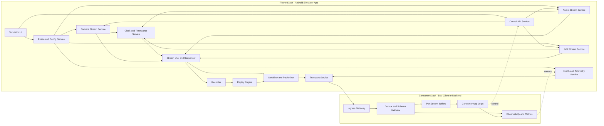

# Glasses Data Simulator (Android Phone) — Lean Requirements

**Platform:** Android app (phone used as simulated glasses device)  
**Document type:** product / engineering requirements (lean)  
**Revision:** 0.1 · **Date:** 2026-04-19

---

## 1. Purpose

Provide a phone-based simulator that behaves like a smart-glasses sensor source so teams can build and validate pipelines before production glasses hardware is broadly available.

The simulator SHALL stream glasses-like data over a stable interface:

- camera frames (configurable rate and resolution),
- audio stream,
- IMU stream,
- custom metadata/events.

---

## 2. Scope

### 2.1 In scope (v1)

- Android app that exposes a **device simulator mode**.
- Configurable camera stream: FPS, resolution, format, optional crop profile.
- Audio stream with fixed chunking and timestamps.
- IMU stream (accelerometer + gyroscope minimum) with configurable rate.
- Metadata/config endpoint: stream settings, calibration placeholders, device profile.
- Session recording and replay (optional in v1, required by v2 if not shipped in v1).
- Fault injection knobs: delay, jitter, frame drop, packet loss simulation.

### 2.2 Out of scope (explicit)

| Item | Rationale |
| --- | --- |
| Claiming production-equivalent optics/noise/power to real glasses | Phone is a development surrogate, not final validation source |
| Full glasses UI/firmware emulation | Goal is data simulation, not complete device virtualization |
| Final model acceptance based only on simulator data | Real-glasses validation remains mandatory |
| Vendor-specific production protocols before schema freeze | Keep v1 generic and versioned |

---

## 3. Why this is needed

- Unblocks app/backend/ML/integration work before glasses are available.
- Enables repeatable CI-style data tests and regression replay.
- Forces early definition of data contracts (timestamps, rates, schema).
- Reduces idle time across teams waiting for limited hardware units.

---

## 4. Architecture (two-stack recommended)

**Requirement:** transport and schema SHALL be versioned so real glasses can replace the simulator with minimal client changes.

**Path semantics:** camera/audio/IMU are data-plane streams; control and profile updates are control-plane; health/metrics are observability-plane.

---

## 5. Data contract requirements

| ID | Requirement |
| --- | --- |
| **D-1** | Every sample/frame SHALL include `monotonic_timestamp_ns` and `sequence_id`. |
| **D-2** | Camera frame payload SHALL include width, height, pixel format, exposure metadata (if available). |
| **D-3** | IMU payload SHALL include sensor type, 3-axis values, units, timestamp, and rate declaration. |
| **D-4** | Audio payload SHALL include sample rate, channels, PCM format, timestamp, and chunk duration. |
| **D-5** | Stream schema SHALL include explicit `schema_version` and backward compatibility policy. |
| **D-6** | Simulator profile SHALL expose declared FoV/intrinsics placeholders (measured or approximated). |

---

## 6. Functional requirements

| ID | Requirement |
| --- | --- |
| **F-1** | User SHALL start/stop each stream independently and as a synchronized bundle. |
| **F-2** | User SHALL configure camera FPS and resolution from predefined safe sets. |
| **F-3** | User SHALL configure IMU sampling rates for accel/gyro independently. |
| **F-4** | System SHALL provide at least one low-latency transport mode for local network/dev testing. |
| **F-5** | System SHALL support deterministic replay of recorded sessions. |
| **F-6** | System SHALL expose fault injection controls (delay/jitter/drop) per stream. |
| **F-7** | System SHALL emit health/status metrics (actual FPS/rates, queue depth, drop counts). |

---

## 7. Non-functional requirements

| ID | Requirement |
| --- | --- |
| **N-1** | Timestamp drift between streams SHALL be bounded and measurable (target threshold TBD). |
| **N-2** | End-to-end simulator transport latency SHALL be measurable and reported (p50/p95). |
| **N-3** | Simulator SHALL run for >= 30 minutes continuously without crash in baseline profile. |
| **N-4** | CPU/memory usage on reference phone SHALL remain within defined budget (TBD). |
| **N-5** | Data output SHALL be reproducible in replay mode given same input recording and config. |

---

## 8. Profiles and realism policy

v1 SHALL define at least 3 simulator profiles:

1. **Fast dev profile** (low resolution, lower rates) for quick iteration.
2. **Nominal glasses-like profile** (target rates/resolution used by product teams).
3. **Stress profile** (high load + fault injection) for robustness tests.

**Policy:** use simulator for integration and early ML prototyping; do not treat simulator-only results as production evidence for perception quality, thermal, or power.

---

## 9. KPI table (v1 gates)

| KPI | Definition | Target |
| --- | --- | --- |
| **Camera fidelity to configured FPS** | Absolute error from target FPS over 5 min run | <= 5% |
| **IMU fidelity to configured rate** | Absolute error from target rate over 5 min run | <= 5% |
| **Audio continuity** | Missing chunk ratio over 10 min | <= 0.5% |
| **Replay determinism** | Payload/timestamp match vs source recording | >= 99.5% |
| **Crash-free run time** | Continuous run under nominal profile | >= 30 min |

---

## 10. Open decisions

1. **Transport choice:** gRPC/WebSocket/UDP or hybrid; local-only vs optional remote.
2. **Wire format:** Protobuf vs JSON+binary.
3. **Recording format:** custom container vs existing media/log container.
4. **Calibration source:** measured per phone model vs static profile presets.
5. **Security mode:** unauthenticated dev LAN vs signed/authenticated session mode.
6. **v1 scope cut:** whether replay ships in v1 or v1.1.

---

## 11. Immediate next steps

1. Freeze v1 schema and sample payloads for camera/audio/IMU.
2. Build Android simulator MVP with one transport and nominal profile.
3. Integrate one downstream consumer and run 30-min stability test.
4. Add replay and fault injection once baseline stream reliability is confirmed.

---

## 12. Glossary

| Term | Meaning |
| --- | --- |
| **Simulator profile** | Named configuration bundle of rates, resolution, and behaviors. |
| **Replay determinism** | Ability to reproduce the same output stream from recorded input. |
| **Monotonic timestamp** | Clock that never moves backward; used for stream alignment. |
| **Fault injection** | Deliberate delay/jitter/drop to test consumer robustness. |

