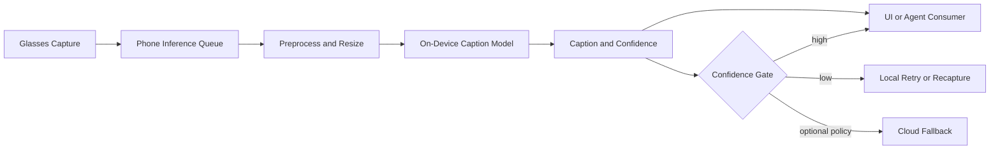

# Mobile On-Device Image Captioning for Glasses Companion — Lean Requirements

**Platform:** Mobile phone companion app (on-device inference)  
**Document type:** product / engineering requirements (lean + feasibility)  
**Revision:** 0.5 · **Date:** 2026-04-19

---

## 0. Executive summary

Smart glasses capture moments continuously, but users have no practical way to search or act on what they saw. Cloud vision APIs add latency, cost, and privacy risk.

**The idea:** companion phone runs an **on-device caption/tag model** — glasses send a still on a discrete trigger; phone returns **short structured metadata** in under 2 seconds; stored as a **searchable memory**, no cloud required by default.

**Why now:** compact VLMs now run on phone NPUs with triage-grade quality. Privacy-first, offline-capable, and cannot be replicated by a phone-only app.

**Ask:** fund a **2–4 week feasibility spike** on 2 reference phones (latency, battery, quality) before committing to full build.

---

## 1. Purpose

Use the phone as an on-device vision assistant for glasses by generating captions from images sent by glasses, then returning concise visual cues for downstream UX and agent workflows.

Primary goal: **content triage** for save/retrieve workflows using short metadata text, while avoiding always depending on cloud vision models for routine caption tasks.

---

## 2. Honest assessment (is this a good idea?)

**Yes, with constraints.** This is a strong idea for latency, privacy, and cost if the scope is kept practical.

Best-fit scenarios:

- short descriptive captions,
- scene/object cues for UI hints,
- low/medium complexity visual understanding,
- **discrete-event memory** (e.g. park-and-save) where retrieval beats prose quality.

Not ideal as the only solution for:

- deep reasoning over complex scenes,
- high-stakes edge cases requiring maximal accuracy,
- very long-form multi-image understanding.

Recommended strategy: **mobile on-device first**, with optional cloud fallback for low-confidence or complex requests.

---

## 3. Why this is needed

- Reduces cloud cost for high-frequency visual queries.
- Improves perceived latency (no round-trip for every caption).
- Improves privacy posture by keeping many frames local.
- Allows offline or poor-network operation.
- Keeps glasses compute light by offloading to phone NPU/GPU/CPU.

---

## 4. Use cases (v1)

### 4.1 Core user-facing use cases

1. **Content triage**  
   Generate short metadata text for saving/retrieving moments.

2. **Find my car (park event memory)**  
   On a **parking / end-of-drive event**, capture a still (or keyframe) from glasses and run on-device caption/tags on the phone so the moment is **easy to retrieve later** (“where did I park?”). Combine with **timestamp + GPS (when available) + thumbnail**; treat caption as a **cue**, not ground truth for level/zone/sign text. **Low-confidence outputs** SHALL avoid false precision (e.g. do not assert garage level from a blurry frame).

3. **Transit / commute navigation memory**  
   At unfamiliar transit stops, airports, or multi-level stations, capture a keyframe at a decision point (gate, platform, exit sign). Phone generates `location_cue` and `scene_context` tags. Stored with timestamp + GPS to fill indoor gaps where GPS alone fails.

4. **Biometric-triggered visual context memory**  
   When a health sensor (watch, ring, or glasses PPG) detects a **HR spike**, glasses capture a keyframe and phone generates a scene tag. Stored as `{timestamp, hr_value, scene_tag, activity_cue, thumbnail}` — answers "what was I doing when my heart rate spiked?" Note: requires **multi-stream timestamp sync**, HR debounce to suppress artifacts, and **stricter privacy/consent policy** (health + visual is a sensitive data class).

5. **Quick scene summary**  
   "What am I looking at?" style short caption (one sentence).

6. **Accessibility cue**  
   Describe nearby objects/labels at a glance for low-vision support.

7. **Task assistance**  
   Brief context line for workflow steps (for example: "coffee machine panel with two buttons and a knob").

8. **Agent handoff context**  
   Send compact caption as context to local/remote assistant without uploading every full-resolution frame.

### 4.2 System/ops use cases

- Run confidence-gated local captioning before deciding cloud escalation.
- Use captions as lightweight telemetry labels (with privacy policy controls).

---

## 5. Scope

### 5.1 In scope (v1)

- Glasses -> phone image transfer and request API.
- On-device caption generation on Android/iOS companion app.
- Short caption output (for example 8-30 words).
- Confidence/quality signal and fallback policy hook.
- Latency and battery telemetry for runtime tuning.

### 5.2 Out of scope (v1)

| Item | Rationale |
| --- | --- |
| Full multimodal dialogue on-device | Separate model class and larger runtime budget |
| OCR-grade document understanding as primary path | Better handled by dedicated OCR pipeline |
| Guaranteed cloud-equivalent quality | Mobile model is intentionally smaller |
| Hard real-time per-frame captioning at video FPS | Not required for user value in v1 |

---

## 6. Functional requirements

| ID | Requirement |
| --- | --- |
| **C-1** | System SHALL accept image capture requests from glasses and run caption inference locally on phone. |
| **C-2** | Output SHALL include `{caption_text, confidence_score, model_version, timestamp}`. |
| **C-2a** | For v1 content triage, output SHALL include compact metadata fields when possible (for example: `entities[]`, `scene_tag`, `action_tag`), in addition to `caption_text`. |
| **C-3** | System SHALL support configurable caption style (`brief`, `detailed`) with v1 default `brief`. |
| **C-4** | System SHALL support confidence-based fallback action (`retry local`, `ask recapture`, `optional cloud`). |
| **C-5** | System SHALL cache recent results for duplicate frame suppression within a short window. |
| **C-6** | System SHALL log latency, memory, and battery-impact metrics with privacy-safe telemetry. |

---

## 7. Non-functional requirements (mobile feasibility)

| ID | Requirement |
| --- | --- |
| **N-1** | Caption latency target (single image, nominal device): **<= 1200 ms p95**. |
| **N-2** | Warm-start latency target: **<= 800 ms p95**. |
| **N-3** | Model footprint target (quantized): **TBD MB** per platform budget. |
| **N-4** | Runtime memory peak SHALL stay within app limits without foreground kills. |
| **N-5** | Sustained usage SHALL remain within acceptable thermal envelope on reference phones. |

Targets are placeholders until device benchmarking is completed.

---

## 8. Technical feasibility (open source vs custom)

### 8.1 Feasibility conclusion

Feasible on modern phones, especially with quantized small/medium vision-language models and hardware acceleration. The main challenge is balancing quality vs latency/battery, not basic possibility.

### 8.2 Open-source path

- Candidate class: compact image-caption or lightweight VLM checkpoints.
- Convert/optimize for mobile runtime (Core ML / NNAPI / vendor accelerators).
- Apply quantization (int8 / mixed precision) and prompt/template constraints.

Pros:

- lower licensing cost,
- model transparency and tunability,
- easier offline deployment.

Risks:

- more in-house optimization effort,
- quality tuning burden for glasses-specific imagery.

### 8.3 Custom/fine-tuned path

- Start from a compact base model and fine-tune for glasses viewpoint and target domains.
- Add post-processing policy for concise, safe captions.

Needed assets:

- paired image-caption dataset from glasses-like viewpoints,
- hard-negative set (ambiguous scenes, blur, glare, low light),
- evaluation rubric (factuality, usefulness, brevity, safety).

Pros:

- better domain fit and consistent style.

Risks:

- dataset/annotation effort,
- ongoing retraining and evaluation overhead.

---

## 9. Recommended architecture

---

## 10. KPIs (initial)

| KPI | Definition | Target |
| --- | --- | --- |
| **Caption latency p95** | Capture received -> caption emitted | <= 1200 ms |
| **Retrieval uplift (primary)** | Improvement in save/retrieve task success vs no-caption baseline on golden set | TBD |
| **Useful caption rate** | Human-rated "useful" on golden set | TBD % |
| **Fallback rate** | % requests escalated beyond local path | TBD % |
| **Crash/OOM rate** | Caption sessions causing app failure | ~0 |
| **Battery delta** | Added power draw during caption sessions | TBD mW |

---

## 11. Open decisions

1. v1 platforms: Android first or Android + iOS together.
2. Model strategy: open-source only vs hybrid with managed model option.
3. Cloud fallback policy: always available, enterprise-only, or disabled by default.
4. Caption style policy: terse factual vs assistant-like descriptive.
5. Privacy policy: retention of images/captions/telemetry.
6. Golden dataset ownership and annotation workflow.

---

## 12. Immediate next steps

1. Build a 2-3 week feasibility spike on 2 reference phones (mid-tier + flagship).
2. Benchmark 2-3 candidate compact models (latency, memory, quality).
3. Define confidence gate and fallback thresholds from pilot data.
4. Freeze v1 KPI thresholds and update this doc to revision 1.0.

---

## 13. Glossary

| Term | Meaning |
| --- | --- |
| **VLM** | Vision-language model. |
| **Confidence gate** | Rule that routes low-confidence outputs to retry/fallback. |
| **Golden set** | Curated evaluation dataset used for release gating. |

