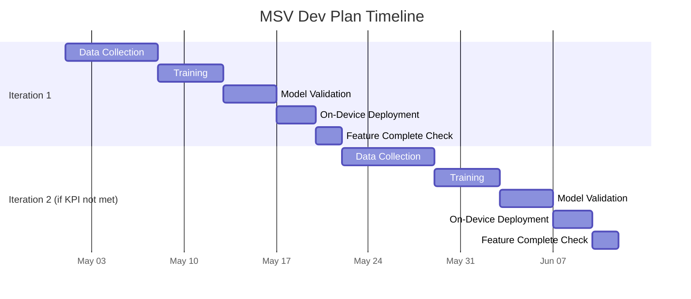

# MSV Development Plan Template

Use this template to run repeated development cycles until target KPI is reached.

## 1) Project Setup
- Project name:
- Owner:
- Date:
- Target release:
- Current build/version:
- Target KPI:
- Current KPI baseline:

## 2) KPI Definition
Define the KPI(s) clearly and make them measurable.

- Primary KPI:
- Secondary KPI(s):
- KPI calculation method:
- Pass/fail threshold for this phase:

### Segment KPI Targets (Fill Values Later)
Use this to define separate KPI thresholds for lighting/background conditions.

| Segment | Target Accuracy | Max False Trigger Rate | Max Miss Rate | Notes |
| --- | --- | --- | --- | --- |
| Low + simple |  |  |  |  |
| Low + complex |  |  |  |  |
| Ambient + simple |  |  |  |  |
| Ambient + complex |  |  |  |  |
| Bright + simple |  |  |  |  |
| Bright + complex |  |  |  |  |

## 3) Timeline View (High-Level)
Use this as a quick status snapshot for each iteration.

Status legend:
- Not Started
- In Progress
- Done
- Blocked

| Iteration | Start | End | Data Collection | Training | Validation | On-Device Deployment | Feature Complete Check | Gate Status |
| --- | --- | --- | --- | --- | --- | --- | --- | --- |
| 1 |  |  |  |  |  |  |  |  |
| 2 |  |  |  |  |  |  |  |  |
| 3 |  |  |  |  |  |  |  |  |
| 4 |  |  |  |  |  |  |  |  |
| 5 |  |  |  |  |  |  |  |  |

### Timeline Gantt View (Optional)
Replace placeholder dates/durations as needed.

## 4) Iteration Loop (Repeat Until Target KPI Is Met)

### Iteration #: 
- Start date:
- End date:
- Objective for this iteration:

#### A. Data Collection
- New data required:
- Data sources:
- Number of samples planned:
- Number of samples collected:
- Labeling status:
- Data quality notes:

##### Coverage Matrix (Required)
Track data coverage across critical conditions.

| Lighting Condition | Simple Background | Complex Background | Notes |
| --- | --- | --- | --- |
| Low light |  |  |  |
| Ambient light |  |  |  |
| Bright light |  |  |  |

#### B. Training
- Training dataset version:
- Feature/config changes:
- Model architecture/version:
- Hyperparameters:
- Compute environment:
- Training start/end time:
- Training notes/issues:

#### C. Model Validation
- Validation dataset version:
- Offline metrics:
  - Accuracy:
  - Precision:
  - Recall:
  - F1:
  - False trigger rate:
  - Miss rate:
- Segment-wise results:
  - Low + simple:
  - Low + complex:
  - Ambient + simple:
  - Ambient + complex:
  - Bright + simple:
  - Bright + complex:
- Segment target check (from "Segment KPI Targets"):
  - Low + simple: Pass/Fail
  - Low + complex: Pass/Fail
  - Ambient + simple: Pass/Fail
  - Ambient + complex: Pass/Fail
  - Bright + simple: Pass/Fail
  - Bright + complex: Pass/Fail
- Failure analysis summary:

#### D. On-Device Deployment
- Device build/version:
- Deployment date:
- Runtime constraints checked:
  - Latency:
  - Memory:
  - CPU:
  - Power:
- On-device test summary:
- Deployment issues:

#### E. Feature Complete Checkpoint
- Scope completed in this iteration:
- Remaining gaps:
- Blockers:
- Risk level:

#### F. KPI Decision Gate
- KPI achieved this iteration? (Yes/No):
- All segment KPI targets passed? (Yes/No):
- If yes:
  - Mark iteration complete.
  - Confirm feature-complete status.
- If no:
  - Record top 3 root causes:
  - Define actions for next iteration:
  - Update next iteration KPI target:

## 5) Iteration Tracker
| Iteration | KPI Result | Passed? | Top Issue | Next Action |
| --- | --- | --- | --- | --- |
| 1 |  |  |  |  |
| 2 |  |  |  |  |
| 3 |  |  |  |  |
| 4 |  |  |  |  |
| 5 |  |  |  |  |

## 6) Exit Criteria
The development loop ends only when all are true:
- Target KPI is met or exceeded.
- Performance is stable across:
  - Low, ambient, and bright lighting conditions.
  - Simple and complex backgrounds.
- On-device constraints are satisfied.
- Feature is marked complete with no critical blockers.

## 7) Sign-Off
- Engineering lead:
- ML lead:
- Product owner:
- Sign-off date:
