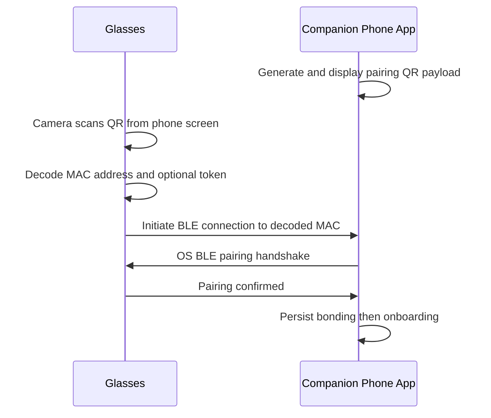

# QR Code Pairing — Requirements

**Feature:** QR-initiated BLE pairing  
**Flow:** Companion app shows QR → glasses camera scans → glasses connect by decoded MAC  
**Revision:** 0.2 · **Date:** 2026-04-19

---

## 1. Purpose

First-time **BLE** bond between **smart glasses** and **companion phone**: phone displays a **pairing QR**; glasses **decode** it and **open a BLE connection** without manual scan lists or PIN entry on glasses.

---

## 2. Pairing flow

---

## 3. Tech feasibility (glasses / RTOS / MCU)

| Topic | Verdict |
| --- | --- |
| **RTOS + MCU** | **Feasible.** QR decode is classical image + Reed–Solomon; no Linux required. |
| **Decoder choice** | Prefer a **small QR-only** C library (e.g. **Quirc**-class): grayscale in, payload out. Avoid full multi-symbology stacks unless needed. |
| **Cost drivers** | **Input size** (crop / downscale before decode), **RAM** for line buffers, **CPU** for binarization + RS — not RTOS itself. |
| **SoC class (e.g. BES2800, Cortex-M33 / M55 / STAR-MC1)** | **Comfortable** for pairing use: short payload, cooperative UX, **burst or low FPS** decode. Confirm **exact SKU**, **which core** owns the camera, and **SRAM budget** after BT/display stacks. |
| **Screen QR** | **Moire / glare** are the main risk; mitigate with **resolution / exposure / ROI**, not a bigger OS. |
| **ML** | **Not required** for v1 pairing decode. Optional ML elsewhere must not block pairing (see **P-6**). |

**Spike (required):** on-target **decode latency (p50/p95)**, **peak RAM**, **flash** for chosen library + buffer at agreed preview resolution.

---

## 4. Scope

**In:** App generates QR; glasses camera + **software** decode; BLE connect from decoded MAC; success/fail UX; **medium** consumer security (§8).

**Out:** PIN on glasses; phone-scans-glasses QR (v1); Wi-Fi-over-QR; implementing full BLE stack; strong OOB crypto beyond §8 stretch.

---

## 5. QR payload (v1 — confirm with firmware + app)

| Field | Notes |
| --- | --- |
| `ble_mac` | Phone BLE MAC `XX:XX:XX:XX:XX:XX` |
| `token` | Optional short random hex; TTL in §8 |

Encode as compact URI (example): `blep://pair?mac=AA:BB:CC:DD:EE:FF&tok=3f9a12c0` — keep payload **~≤100 chars** for low QR version.

**QR graphic:** Model 2, **EC M**, target **V3–V5**; **≥200×200 px** on phone; quiet zone ≥4 modules; **black on white** only in v1.

---

## 6. Glasses requirements

| ID | Requirement |
| --- | --- |
| **P-1** | Decode ≤ **3 s** after QR fully in frame (indoor baseline). |
| **P-2** | Works at **30–60 cm** phone–camera distance. |
| **P-3** | Tolerate **LCD/OLED moiré and glare** within agreed lighting range. |
| **P-4** | After decode, start BLE connect to MAC within **500 ms**. |
| **P-5** | Decode failure → visible error + retry. |
| **P-6** | Pairing decode path **standalone** — no dependency on optional ML stacks. |

---

## 7. Companion app requirements

| ID | Requirement |
| --- | --- |
| **A-1** | Show pairing QR on first-launch / onboarding before relying on BLE. |
| **A-2** | New **token** each time the pairing screen is shown (no stale QR). |
| **A-3** | If TTL: show **countdown** or clear expiry UX. |
| **A-4** | On incoming BLE from glasses, surface **OS pairing** as needed. |
| **A-5** | Expired token → prompt **refresh QR**. |
| **A-6** | **iOS + Android**; min OS versions TBD. |

---

## 8. Security (medium baseline)

| ID | Requirement |
| --- | --- |
| **S-1** | Token TTL **60–120 s** (pick one in impl). |
| **S-2** | Token **CSPRNG**, ≥ **64 bits** entropy. |
| **S-3** | Reject post-TTL connects; require new QR. |
| **S-4** | No long-lived secrets in QR payload. |
| **S-5** | Bonding uses **OS BLE** secure pairing where available. |

**Stretch:** BLE **OOB** payload via QR — needs stack + product sign-off.

---

## 9. UX

| ID | Requirement |
| --- | --- |
| **U-1** | One-line instruction on QR screen (e.g. look at code through glasses). |
| **U-2** | Success feedback on both sides within **1 s** of bond complete. |
| **U-3** | E2E: QR shown → bonded ≤ **15 s** typical. |
| **U-4** | **“Can’t scan?”** fallback (e.g. manual BLE pick) — v1 vs v2 TBD. |

---

## 10. Open decisions

| # | Decision |
| --- | --- |
| **Q-1** | QR carries **phone MAC** (glasses connect) vs **glasses MAC** (phone connects) — locks BLE roles. |
| **Q-2** | Token TTL value. |
| **Q-3** | OOB stretch: feasible on glasses stack? |
| **Q-4** | U-4 fallback in v1? |
| **Q-5** | Min iOS / Android. |
| **Q-6** | Multi-phone bonding rules. |

---

## 11. KPIs

| KPI | Target |
| --- | --- |
| Decode (in frame → string) | ≤ 3 s |
| Decode → BLE connected | ≤ 2 s |
| E2E (QR shown → bonded) | ≤ 15 s |
| First-try success (lab) | TBD % |
| Expired-token reject | 100% |

---

## 12. Glossary

| Term | Meaning |
| --- | --- |
| **BLE / MAC / bonding** | Standard Bluetooth LE terms. |
| **OOB** | Out-of-band pairing data (here: via QR). |
| **TTL** | Token lifetime. |

---

## References

Bluetooth LE Secure Connections; ISO/IEC 18004 (QR); Apple CoreBluetooth; Android BluetoothGatt.
