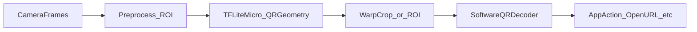

# QR Code (TFLite Micro) — lean requirements

**Platform:** smart glasses (on-device)  
**Runtime:** TensorFlow Lite Micro  
**Document type:** product / engineering requirements (no implementation artifacts)  
**Revision:** 1.0 · **Date:** 2026-04-19

---

## 1. Purpose

Ship a **small on-device neural model** (TensorFlow Lite Micro) that improves **QR discovery and geometry estimation** under difficult real-world capture on smart glasses: rolling shutter, motion blur, defocus, glare, curved and specular packaging, and cluttered backgrounds.

The model is expected to pair with a **traditional software QR decoder** (decode remains outside the TFLM graph unless a future phase explicitly expands scope). Keeping decode out of TFLM is the default approach to meet the **≤ 250KB** model budget and to keep latency predictable.

---

## 2. Scope

### 2.1 In scope

- **QR-only** assistance to the product pipeline, for example:

  - **Presence / confidence** (is a QR likely in view?), and/or  
  - **Axis-aligned bounding box** for ROI, and/or  
  - **Four corner keypoints** (homography-ready for warp-and-decode), and/or  
  - **Auxiliary hints** (e.g., coarse scale) only if tied to measurable decode or latency wins.

- **Training data** that is **comprehensive** relative to the glasses domain: **real captures + synthetic or heavily randomized** data aligned to glasses optics, ISP, and motion.

- **Robustness** to: range (expressed as **angular subtense** of the code, not only distance), motion blur, defocus, glare and specular highlights, low light, partial occlusion, perspective skew, in-plane rotation, modest out-of-plane rotation, **curvature**, difficult materials (**including a shiny metal can**), reflective/transmissive media, and print defects.

- **Interface contract** between the model output and the decoder (coordinate frame, tensor semantics, thresholds, max proposals).

### 2.2 Out of scope (explicit)

| Item | Rationale |
| --- | --- |
| **1D barcode** detection or decoding (UPC, EAN, Code 128, etc.) | Not required; avoids dataset and metric sprawl |
| **Non-QR 2D symbologies** (Data Matrix, Aztec, PDF417, …) | Separate program phase unless explicitly added |
| **Full payload decode inside TFLM** | Size, latency, and validation complexity; software decoder preferred |
| **Server-side inference** as an acceptance gate for “glasses micro model” | Optional product track; not part of core acceptance |

---

## 3. “Are there various QR types?”

For product language, **“QR type”** usually means **QR Code Model 2** per ISO/IEC 18004, with **appearance** varying by:

| Dimension | What changes visually |
| --- | --- |
| **Model** | Model 2 (typical) vs legacy Model 1 |
| **Version (V1–V40)** | Module count / physical size at fixed distance |
| **Error correction** | L, M, Q, H — different redundancy (“busier” modules) |
| **Mask** | 8 mask patterns — different black/white texture |
| **Data mode mix** | Numeric / alphanumeric / byte / kanji — different interior patterns |
| **Printing / damage** | Low contrast, misregistration, crumple, dirt, partial color, logo in safe area |
| **Display vs print** | Screen QR (moiré, refresh); inverse / colored QR |

**Optional stretch (v2 dataset):** **Micro QR** (different finder layout), or rare variants; **primary symbology for v1: QR Model 2.**

---

## 4. Recommended system architecture

**Requirement:** The specification that ships with the product SHALL define the **handoff** from TFLM to the decoder: output layout, units, ordering of corners, confidence handling, and maximum number of simultaneous candidates.

---

## 5. Model requirements

| ID | Requirement |
| --- | --- |
| **M-1** | Target runtime: **TensorFlow Lite Micro** on the glasses compute path (MCU and/or documented accelerator build target). |
| **M-2** | **Flash budget:** total on-device TFLM artifacts **≤ 250 KB** for the accepted definition in **M-3** (fill numeric targets per SKU in the KPI table). |
| **M-3** | **Size accounting (must pick one and use it in KPIs):** either (a) **int8 weights file size only**, or (b) **weights + model metadata + interpreter overhead** required to run the graph. If ambiguous, report **both** in validation. |
| **M-4** | **Quantization:** default **int8** full-integer path; document representative calibration / representative dataset for conversion. |
| **M-5** | **Outputs:** minimum acceptable is **four corners** *or* **axis-aligned bbox + quality score**; additional heads only with justified metrics. |
| **M-6** | **Throughput:** state target **effective FPS** at a fixed **post-ROI** resolution (e.g., QVGA/VGA thumbnail), not undefined full-sensor paths. |
| **M-7** | **Ops / delegates:** document allowed TFLM op subset and whether an NPU/DSP delegate is in scope for a given SKU. |

---

## 6. Dataset requirements (real + synthetic)

### 6.1 Real captures (minimum dimensions to cover)

| Axis | Coverage notes |
| --- | --- |
| **Device** | Representative glasses camera(s); stratify if multiple SKUs |
| **Range** | Min/max **angular size** of QR on sensor (degrees or % of frame height) |
| **Lighting** | Office, retail aisle, warehouse, outdoor sun/shade, low light + artificial |
| **Substrate** | Matte paper, glossy label, pouch film, glass reflection, **shiny metal can**, curved bottle, creased cardboard, shrink wrap deformation |
| **Motion** | Static, walking, head turn; **rolling-shutter skew** treated as first-class |
| **Occlusion / defect** | Finger/partial cover, folds, dirt, scratches, low ink, specular streaks |
| **Screen QR** | Phone/laptop LCD/OLED (moiré / refresh interaction) |

### 6.2 Synthetic / augmented data

- **Rendering or strong aug** tuned to match **glasses ISP** statistics where possible: tone mapping, sharpening, noise, color temperature, compression.
- **Randomize:** motion blur direction and magnitude, defocus, glare blobs, vignetting, lens distortion, background clutter, QR **version / EC / mask** sampling, optional logo overlay in safe regions.

### 6.3 Splits and hygiene

- **No leakage:** disjoint splits by scene, subject, object ID, and capture session as appropriate.
- **Synthetic–real gap:** hold out real-only buckets for regression.
- **Labels:** corner or bbox tolerance in pixels at labeled resolution; inter-annotator agreement threshold documented.

---

## 7. Evaluation metrics (acceptance-oriented)

| Metric | Role |
| --- | --- |
| **Decoder success rate** (primary north star) | Given model proposals, does the **software decoder** succeed on a fixed test suite? |
| **Geometry error** | Mean / p95 corner error after normalization, or equivalent homography error |
| **Precision / recall** | On QR-present vs QR-absent scenes (shelves, faces, dense text) |
| **Bucketed robustness** | Separate scores for glare, blur, curvature bins, material class |

---

## 8. Non-functional requirements (glasses)

- **Thermal / duty cycle:** always-on vs burst scan; maximum sustained power envelope referenced in KPIs.
- **Privacy:** on-device processing by default; no retention of raw failure video unless explicitly approved.
- **Safety / abuse:** rate-limit or confirm high-risk actions from decoded payloads (product policy; documented separately).

---

## 9. KPI table (fill per SKU)

Measure under **fixed** conditions: camera mode, ROI resolution, CPU/DSP clock policy, batch size 1, warmed caches, defined test build.

**E2E latency** = timestamp of frame (or exposure midpoint) **→** first **successful decode** or agreed “actionable” event on the golden suite.

| KPI | Definition / setup | Target | Notes |
| --- | --- | --- | --- |
| **TFLM model size** | Per **M-3** (weights-only and/or total on-device) | **≤ 250 KB** | Publish which definition is contractual |
| **Model inference time** | Median / p95 per invocation on target core @ stated frequency | TBD ms / TBD ms | Include owned preprocess if in same task |
| **E2E latency** | Frame → decode success (or tracking lock) | TBD ms / TBD ms | Optional: cold-start first success |
| **Power (baseline)** | Camera pipeline **without** TFLM in loop | TBD mW | Matched brightness / preview |
| **Power (+ model)** | Same, with TFLM at **target duty cycle / FPS** | TBD mW | Duty cycle must be stated |
| **Power delta** | (+model) − (baseline) | TBD mW | Primary product comparison |
| **Energy per successful scan** | Scripted harness, mJ per successful decode | TBD mJ | Captures false positives and retries |

---

## 10. Validation and release policy (documentary)

- **Golden suite:** describe required scene categories (glare can, curved label, motion blur, no-QR negatives, etc.) and minimum pass rates per category.
- **Regression gates:** policy on whether releases **block** on model byte size, p95 inference, or E2E regressions (to be decided by program management).
- **Canary:** optional field metrics (false scan, decode failure by bucket).

---

## 11. Updateability and compatibility

- **OTA:** model version id, rollback, and compatibility matrix with decoder version.
- **i18n:** payloads may be non-Latin; UI and telemetry must not assume Latin-only content.

---

## 12. Open decisions

1. **ML boundary:** geometry-only vs adding a small **QR vs clutter** classifier head.  
2. **Success metric weighting:** emphasize **decoder success** over pure detection mAP for product acceptance.

---

## 13. Glossary

| Term | Meaning |
| --- | --- |
| **EC level** | Error correction capacity: L < M < Q < H |
| **Module** | Smallest black/white cell of the QR symbol |
| **Version** | QR size class (V1 smallest grid, up to V40) |
| **Mask** | One of eight XOR patterns applied in the QR standard |
| **Micro QR** | Smaller ISO symbol; optional stretch goal |

---

## References

- ISO/IEC 18004 (QR Code) — [ISO catalogue entry](https://www.iso.org/standard/62021.html)  
- TensorFlow Lite Micro — project documentation as pinned by your firmware team
