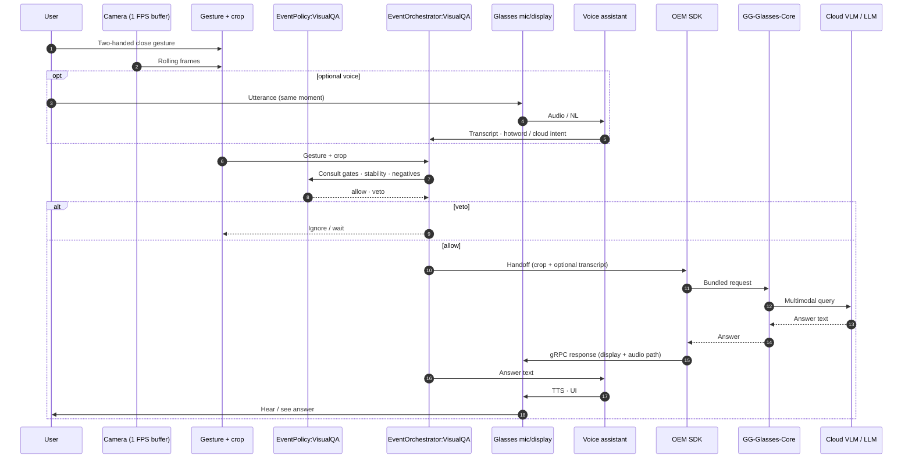
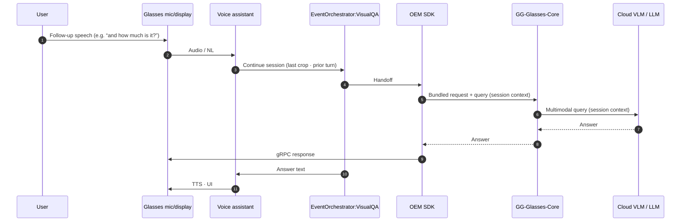
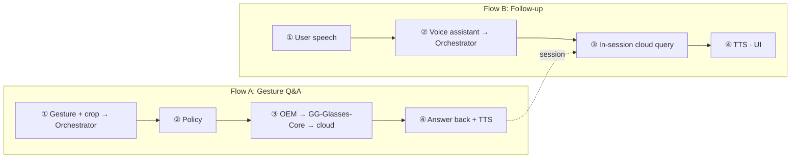

# Idea 1: Gesture-Driven Image Crop for Visual Q&A

**Goal:** Let the user aim the assistant at **one region** of the scene with a **two-handed close gesture**. Glasses detect the gesture and **crop** from a **1 FPS frame buffer**; the user may or may not speak at the same time. **EventOrchestrator:VisualQA** bundles the crop and any transcript from the **voice assistant**, then hands off through **OEM SDK** to **GG-Glasses-Core** for a **cloud VLM/LLM** answer. No **on-device VLM** on the phone and no persistent memory: only **in-session** state for short follow-ups.

**Architecture diagram:** [idea1_gesture_visual_qa_architecture.md](./idea1_gesture_visual_qa_architecture.md) (rendered Mermaid) · source: [idea1_gesture_visual_qa_architecture.mermaid](./idea1_gesture_visual_qa_architecture.mermaid)

---

## How this differs from Idea 2 and 3

| | **Idea 1** | **Idea 2 / 3** |
| --- | --- | --- |
| **Trigger** | **User gesture** (+ optional voice) | Automatic (sensors or Ambient Scene Understanding) |
| **Purpose** | **Q&A** on a user-chosen crop | Save parking marker or meal log |
| **Memory** | **None** (one-shot fetch; in-session follow-up only) | Ambient-Memory: always write event entry |
| **Vision on phone** | **None** (crop + Q&A via cloud only) | Idea 2/3: **On-device VLM** for scene/OCR |
| **Cloud** | **Cloud VLM/LLM** for every answer | Idea 2: mostly on-device; Idea 3: Nutrition API only |

---

## Terminology: “cue”

| Term | Meaning |
| --- | --- |
| **Audio/UI cue** | Short TTS or display feedback while the Q&A path runs (e.g. “Looking at that…” ). Optional; keep brief because the user is mid-task. |
| **Processing cue** | Same as audio/UI cue during orchestration (not the final answer). |
| **Final answer** | Spoken/displayed via **voice assistant** after cloud returns text. |

---

## Components (who does what)

| Component | Role |
| --- | --- |
| **Glasses: Camera** | **1 FPS** rolling buffer; on gesture, pick **sharpest frame** with hands stable in frame. |
| **Glasses: Gesture + crop** | Lightweight on-glasses pipeline: **two-handed close** (**1–2 s visibility**), **crop lock**, optional edge snap. No phone-side VLM. |
| **Glasses: Mic & display** | Optional utterance with gesture; show/TTS results. |
| **EventPolicy:VisualQA** | **Gesture gates**, stability window, **negatives** (incidental hand motion, walking, etc.). |
| **EventOrchestrator:VisualQA** | Policy check, **bundle** crop + optional transcript, **hand off to OEM SDK**, hold **in-session** state, route answer to voice assistant. |
| **OEM SDK** | Inside **SS-Glasses-Core**: **gRPC** to glasses for **cloud handoff** and **responses**; passes **bundled request** to **GG-Glasses-Core**; returns **gRPC response** to mic/display. |
| **GG-Glasses-Core** | **Cloud session**, auth, multimodal client. Sends **crop** (+ voice text when present) to **cloud VLM/LLM**; carries **conversation context** for follow-ups. |
| **Cloud VLM / LLM** | Multimodal **answer**; only **GG-Glasses-Core** talks to cloud for this path. |
| **Voice assistant** | Optional speech with gesture, **hotword** (e.g. Hey Gemini) for explicit cloud intent, **follow-up** questions, **TTS/UI**; passes transcript and cloud flags to orchestrator. |

---

## Routing: speech optional, cloud for answers

There is **no on-device VLM** on the phone. All visual Q&A goes to **cloud** when the policy allows and the network is available.

| User action | What gets bundled | Cloud query |
| --- | --- | --- |
| **Gesture only** (silent) | Crop only | **Image-only** multimodal query (default: identify / describe the region). |
| **Gesture + speech** | Crop + transcript | Multimodal query with the user’s question. |
| **Hotword / explicit cloud** (e.g. Hey Gemini) | Crop + transcript; VA sets **cloud intent** | Same cloud path; hotword confirms escalation even if the question is short. |

The orchestrator does not run a local vision model; **gesture + crop** on glasses is the only on-device vision work.

---

## Flow A: Gesture Q&A (user-initiated)

### Step-by-step

1. **Buffer and gesture**: Camera maintains **1 FPS** frames. User performs **two-handed close** (**1–2 s visibility**); glasses lock crop and pick the best buffered frame.
2. **Optional voice**: User may stay silent or speak with the gesture. **Voice assistant** supplies transcript and whether a **hotword / cloud intent** was detected.
3. **Policy**: **EventPolicy:VisualQA** allows or **vetoes** (unstable gesture, incidental motion).
4. **Cloud handoff**: **EventOrchestrator:VisualQA** → **OEM SDK** → **GG-Glasses-Core** → **cloud VLM/LLM** (crop only, or crop + question). Answer returns **cloud → GG-Glasses-Core → OEM SDK**.
5. **Glasses response**: OEM sends **gRPC response** to mic/display; orchestrator passes answer text to **voice assistant** for **TTS/UI**. Target **~1–2.5 s** end-to-end when online.

---

## Flow B: Follow-up (user)

Uses **in-session** state in **EventOrchestrator:VisualQA** and **GG-Glasses-Core** cloud session; no new gesture required for short follow-ups.

---

## End-to-end picture

---

## Design notes

- **User-triggered**, one-shot: Unlike Ideas 2/3, nothing is written to **Ambient-Memory**; the gesture fetch is ephemeral except for **in-session** follow-up state.
- **No on-device VLM on phone**: Gesture/crop stays on glasses; Q&A is **cloud-only** via **GG-Glasses-Core** (keeps the phone stack simple).
- **Cloud path is explicit**: **EventOrchestrator:VisualQA** → **OEM SDK** → **GG-Glasses-Core** ↔ **cloud VLM/LLM**.
- **Compressed crop only** to cloud: Never upload full frames; JPEG of crop region.
- **Privacy**: Crops and answers are not persisted after the session ends.
- **Failure modes**: Cloud or network unavailable → brief error / retry / re-gesture; gesture false positive → policy veto.

---

## Related artifacts

| File | Purpose |
| --- | --- |
| `idea1_gesture_visual_qa_architecture.mermaid` | System architecture (Mermaid source) |
| `idea1_gesture_visual_qa_architecture.md` | GitHub-renderable architecture |
| `tmp/Idea1.png` | Original concept sketch |
| `idea2.md` / `idea3.md` | Reference for voice assistant + SS-Glasses-Core patterns |
