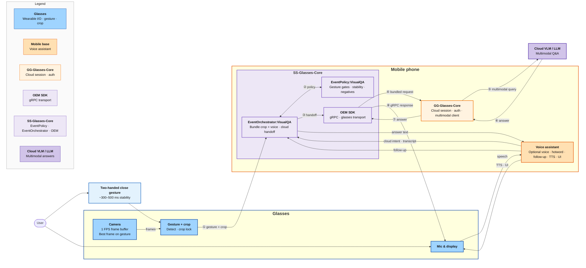

# Idea 1 — Gesture-Driven Image Crop for Visual Q&A

```mermaid
%% Idea 1 — Gesture-Driven Image Crop for Visual Q&A · mermaid.live
%% LR columns: Glasses | Mobile (voice assistant inside) — Mic↔VA across column boundary
%% No on-device VLM on phone: crop on glasses → orchestrator → GG-Glasses-Core ↔ Cloud VLM
%% <b>…</b> = bold title inside a box
%%{init: {'flowchart': {'htmlLabels': true}}}%%

flowchart LR
    subgraph GCol[" "]
        direction TB
        User([User])
        TwoHand["<b>Two-handed close gesture</b><br/>~300–500 ms stability"]
        subgraph Glasses["<b><span style='font-size:22px'>Glasses</span></b>"]
            direction TB
            Cam["<b>Camera</b><br/>1 FPS frame buffer<br/>Best frame on gesture"]
            GestCrop["<b>Gesture + crop</b><br/>Detect · crop lock"]
            Mic["<b>Mic & display</b>"]
        end
    end

    subgraph Mobile["<b><span style='font-size:22px'>Mobile phone</span></b>"]
        direction TB
        VA["<b>Voice assistant</b><br/>Optional voice · hotword · follow-up · TTS · UI"]
        subgraph SSGC["<b><span style='font-size:18px'>SS-Glasses-Core</span></b>"]
            direction TB
            PolicyVQ["<b>EventPolicy:VisualQA</b><br/>Gesture gates · stability · negatives"]
            OrchVQ["<b>EventOrchestrator:VisualQA</b><br/>Bundle crop + voice · cloud handoff"]
            OEM["<b>OEM SDK</b><br/>gRPC · glasses transport"]
        end
        GGGC["<b>GG-Glasses-Core</b><br/>Cloud session · auth · multimodal client"]
    end

    CloudVLM["<b>Cloud VLM / LLM</b><br/>Multimodal Q&A"]

    subgraph Legend["Legend"]
        direction LR
        LgG["<b>Glasses</b><br/>Wearable I/O · gesture · crop"]
        LgM["<b>Mobile base</b><br/>Voice assistant"]
        LgGG["<b>GG-Glasses-Core</b><br/>Cloud session · auth"]
        LgOEM["<b>OEM SDK</b><br/>gRPC transport"]
        LgS["<b>SS-Glasses-Core</b><br/>EventPolicy · EventOrchestrator · OEM"]
        LgC["<b>Cloud VLM / LLM</b><br/>Multimodal answers"]
    end

    User --> TwoHand
    TwoHand --> GestCrop
    Cam -->|"frames"| GestCrop
    GestCrop -->|"① gesture + crop"| OrchVQ
    OrchVQ <-->|"② policy"| PolicyVQ

    OrchVQ -->|"③ handoff"| OEM
    OEM -->|"④ bundled request"| GGGC
    GGGC -->|"⑤ multimodal query"| CloudVLM
    CloudVLM -->|"⑥ answer"| GGGC
    GGGC -->|"⑦ answer"| OEM
    OEM -->|"⑧ gRPC response"| Mic

    OrchVQ -->|answer text| VA
    VA -->|cloud intent · transcript| OrchVQ

    User --> Mic
    Mic -->|speech| VA
    VA -->|TTS · UI| Mic
    VA -->|follow-up| OrchVQ

    classDef glasses fill:#9fd4ff,stroke:#0d47a1,color:#111,stroke-width:2px
    classDef mobile fill:#ffe0b2,stroke:#e65100,color:#111,stroke-width:2px
    classDef ggCore fill:#fff3e0,stroke:#ef6c00,color:#111,stroke-width:2px
    classDef oemSdk fill:#ede7f6,stroke:#7e57c2,color:#111,stroke-width:2px
    classDef ssCoreLight fill:#ede7f6,stroke:#7e57c2,color:#111,stroke-width:2px
    classDef cloudVlm fill:#d1c4e9,stroke:#512da8,color:#111,stroke-width:2px
    classDef legendGlasses fill:#9fd4ff,stroke:#0d47a1,color:#111
    classDef legendMobile fill:#ffe0b2,stroke:#e65100,color:#111
    classDef legendGG fill:#fff3e0,stroke:#ef6c00,color:#111
    classDef legendOEM fill:#ede7f6,stroke:#7e57c2,color:#111
    classDef legendSS fill:#ede7f6,stroke:#7e57c2,color:#111
    classDef legendCloud fill:#d1c4e9,stroke:#512da8,color:#111
    classDef legendFrame fill:#fafafa,stroke:#9e9e9e,color:#111
    classDef colHidden fill:none,stroke:none,color:#111
    classDef userGesture fill:#e3f2fd,stroke:#1565c0,color:#111,stroke-width:2px

    style SSGC fill:#ede7f6,stroke:#7e57c2,stroke-width:2px
    style GCol fill:none,stroke:none
    style Glasses stroke:#0d47a1,stroke-width:2px
    style Mobile stroke:#e65100,stroke-width:2px

    class TwoHand userGesture
    class Cam,Mic,GestCrop glasses
    class VA mobile
    class GGGC ggCore
    class OEM oemSdk
    class PolicyVQ,OrchVQ ssCoreLight
    class CloudVLM cloudVlm
    class GCol colHidden
    class Legend legendFrame
    class LgG legendGlasses
    class LgM legendMobile
    class LgGG legendGG
    class LgOEM legendOEM
    class LgS legendSS
    class LgC legendCloud
```
