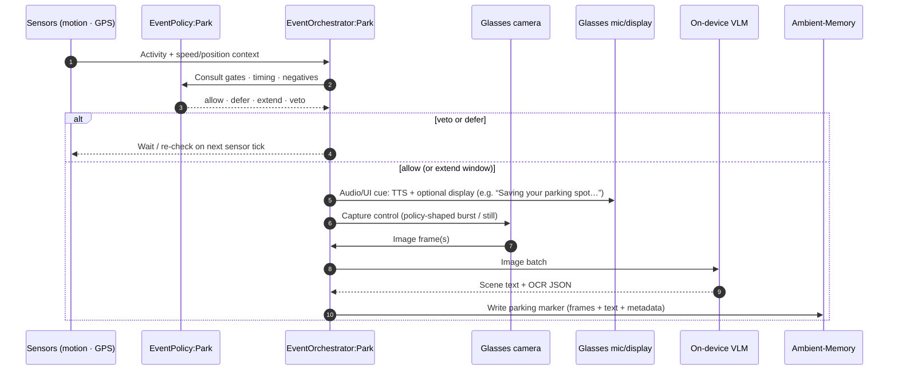
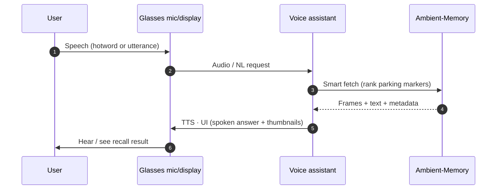
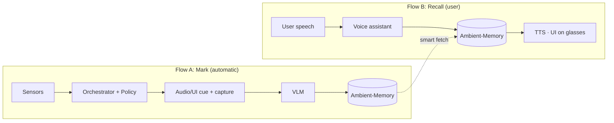

# Idea 2: Mark Car Parking Spot

**Goal:** When the user finishes driving and parks, the system automatically captures a useful visual memory of the spot and makes it easy to recall later (“Where did I park?”). Without relying on cloud vision by default.

**Architecture diagram:** [idea2_mark_car_parking_spot_architecture.md](./idea2_mark_car_parking_spot_architecture.md) (rendered Mermaid) · source: [idea2_mark_car_parking_spot_architecture.mermaid](./idea2_mark_car_parking_spot_architecture.mermaid)

---

## Terminology: “cue”

| Term | Meaning |
| --- | --- |
| **Audio/UI cue** | User-facing feedback when a park save runs: **spoken TTS** through glasses speakers, plus an **optional short message or icon on the display**. Not a separate alert sound unless product adds one. |
| **Retrieval cue (text)** | **Text** from the VLM (caption + OCR) stored with the parking marker to help search and recall later. Not audio. |

---

## Components (who does what)

| Component | Role |
| --- | --- |
| **Glasses: Camera** | Policy-shaped capture: sends image frames to the phone when the orchestrator allows it. |
| **Glasses: Mic & display** | User I/O: speech in; audio cues (TTS) and optional display UI out. |
| **Mobile: Sensors** | Motion activity and GPS on the phone; feeds **EventOrchestrator:Park** only (not the voice assistant). |
| **EventPolicy:Park** | Gates, timing, and negative rules: allow, defer, extend, or veto a park capture. |
| **EventOrchestrator:Park** | Runs the park path: consult policy, play an **audio/UI cue** to the user, control capture, call on-device VLM, write to memory. |
| **On-device VLM** | Scene understanding + OCR on the phone; returns **text retrieval cues** (caption + OCR JSON) to the orchestrator. |
| **Ambient-Memory** | Stores frames + text (thumbnail, caption/OCR, timestamp, GPS when available) for later retrieval. |
| **Voice assistant** | Hotword, optional GPS nudge, and **recall**: smart-fetch from Ambient-Memory and speak/show results on glasses. |

---

## Flow A: Automatic “mark parking spot” (end of drive)

Triggered when the phone infers the user has parked (motion/GPS context). No OEM vehicle SDK; inference is from on-device sensors plus policy.

### Step-by-step

1. **Context arrives**: Motion activity and GPS on the phone stream into **EventOrchestrator:Park** (e.g. vehicle stopped, walking detected, low speed near a plausible park location).
2. **Policy check**: Orchestrator asks **EventPolicy:Park** for a decision:
   - **Allow**: proceed with capture now.
   - **Defer**: not yet; wait for more sensor evidence.
   - **Extend**: widen the capture window (e.g. user still exiting the car).
   - **Veto**: do not capture (false park, garage transition, user dismissed, etc.).
3. **Audio/UI cue to user**: On allow/extend, orchestrator sends **spoken TTS** (audio cue) through glasses speakers and, optionally, a **short line or icon on the display** so the user knows a save is happening. Brief and skippable if policy allows silent capture.
4. **Capture**: Orchestrator sends **capture control** to the glasses camera; camera returns **frames** into SS-Glasses-Core (no cloud round-trip for the image path).
5. **Understand scene**: Orchestrator passes an image batch to **on-device VLM**; VLM returns **scene description + OCR** (signs, level, zone text when readable). Store this as a **text retrieval cue** in the marker, not ground truth; avoid false precision on blurry frames.
6. **Persist marker**: Orchestrator writes a **parking marker** to **Ambient-Memory**: keyframe(s), VLM text, timestamp, GPS if available, thumbnail for UI.

### What gets stored (parking marker)

- One or more frames / thumbnail from glasses  
- VLM caption + OCR JSON  
- Timestamp  
- GPS (when available)  
- Enough metadata for ranked recall later  

---

## Flow B: Recall (“Where did I park?”)

User-initiated (or nudged) lookup. Sensor data does **not** go directly to the voice assistant; recall uses **Ambient-Memory** written during Flow A.

### Step-by-step

1. **User speaks**: Hotword or natural language on glasses (e.g. “Where did I park?”).
2. **Voice path**: Mic/display sends **speech** to the on-device **voice assistant** on the phone.
3. **Smart fetch**: Voice assistant queries **Ambient-Memory** (time, location, caption/OCR, recency) and picks the best parking marker(s).
4. **Respond on glasses**: Assistant returns **TTS + UI** to mic/display (spoken summary, optional thumbnail or short text on display).
5. **Optional nudge**: Product may use **GPS nudge** inside the voice assistant (e.g. “You’re near where you parked yesterday”) without wiring raw sensor streams to VA; location context can also come from markers already stored with GPS at save time.

---

## End-to-end picture

---

## Design notes

- **No OEM SDK**: Park detection uses phone **motion + GPS** and glasses **camera frames** into SS-Glasses-Core; no direct vehicle bus integration in this design.
- **Privacy / offline**: Capture, VLM, and storage are on-device by default; cloud is out of scope for this idea unless confidence is low (separate policy).
- **Separation of concerns**: **Sensors → orchestrator** for *when* to save; **voice assistant → Ambient-Memory** for *how* to answer recall questions.
- **Low-confidence VLM**: Prefer vague **retrieval text** (“indoor garage, pillar B area”) over wrong specifics (e.g. asserting “Level P3” from a blurry sign).

---

## Related artifacts

| File | Purpose |
| --- | --- |
| `idea2_mark_car_parking_spot_architecture.mermaid` | System architecture (Mermaid source) |
| `idea2_mark_car_parking_spot_architecture.md` | GitHub-renderable architecture |
| `idea2_mark_car_parking_spot_eraser.dsl` | Eraser.io diagram-as-code (earlier draft; sensor→VA line removed in architecture) |
| `mobileImageCaption/docs/mobile_ondevice_image_caption_requirements.md` | Broader on-device caption / park-memory requirements |
