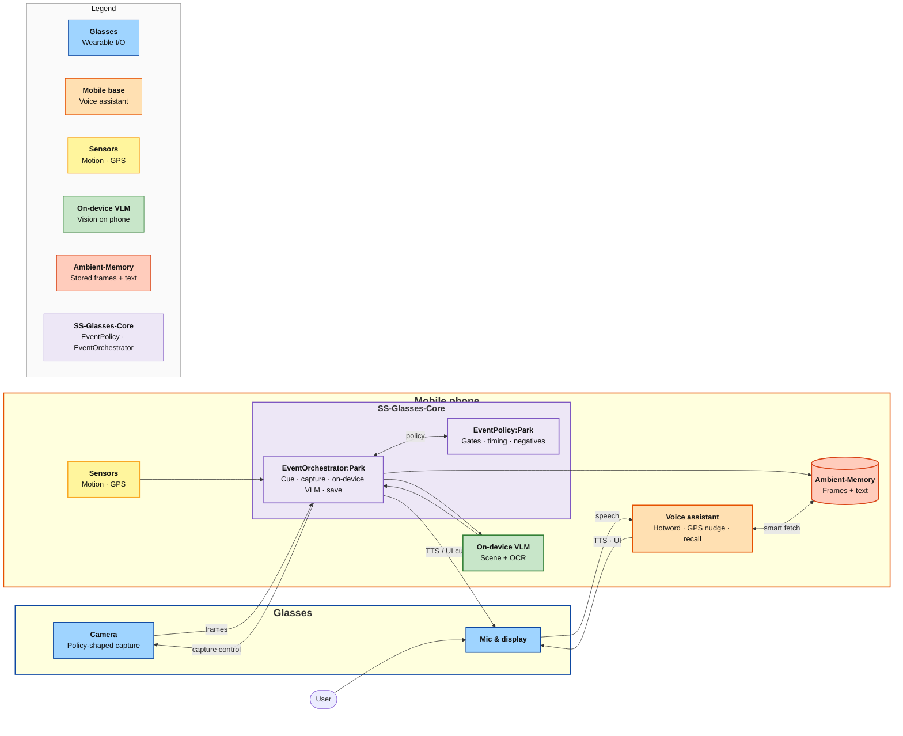

# Idea 2 — Mark Car Parking Spot

```mermaid
%% Idea 2 — Mark Car Parking Spot · mermaid.live
%% LR columns: Glasses | Mobile (voice assistant inside) — Mic↔VA across column boundary
%% <b>…</b> = bold title inside a box
%% Glasses / Mobile phone labels: centered (native subgraph title), big + bold via HTML
%%{init: {'flowchart': {'htmlLabels': true}}}%%

flowchart LR
    subgraph GCol[" "]
        direction TB
        User([User])
        subgraph Glasses["<b><span style='font-size:22px'>Glasses</span></b>"]
            direction TB
            Cam["<b>Camera</b><br/>Policy-shaped capture"]
            Mic["<b>Mic & display</b>"]
        end
    end

    subgraph Mobile["<b><span style='font-size:22px'>Mobile phone</span></b>"]
        direction TB
        VA["<b>Voice assistant</b><br/>Hotword · GPS nudge · recall"]
        Sens["<b>Sensors</b><br/>Motion · GPS"]
        subgraph SSGC["<b><span style='font-size:18px'>SS-Glasses-Core</span></b>"]
            direction TB
            PolicyCP["<b>EventPolicy:Park</b><br/>Gates · timing · negatives"]
            OrchCP["<b>EventOrchestrator:Park</b><br/>Cue · capture · on-device VLM · save"]
        end
        VLM["<b>On-device VLM</b><br/>Scene + OCR"]
        AMEM[("<b>Ambient-Memory</b><br/>Frames + text")]
    end

    subgraph Legend["Legend"]
        direction LR
        LgG["<b>Glasses</b><br/>Wearable I/O"]
        LgM["<b>Mobile base</b><br/>Voice assistant"]
        LgSen["<b>Sensors</b><br/>Motion · GPS"]
        LgL["<b>On-device VLM</b><br/>Vision on phone"]
        LgA["<b>Ambient-Memory</b><br/>Stored frames + text"]
        LgS["<b>SS-Glasses-Core</b><br/>EventPolicy · EventOrchestrator"]
    end

    Sens --> OrchCP
    OrchCP <-->|policy| PolicyCP

    Cam -->|"frames"| OrchCP
    OrchCP -->|"capture control"| Cam
    OrchCP -->|"TTS / UI cue"| Mic

    OrchCP --> VLM
    VLM --> OrchCP
    OrchCP --> AMEM

    User --> Mic
    Mic -->|speech| VA
    VA -->|TTS · UI| Mic
    VA <-->|smart fetch| AMEM
   
    classDef glasses fill:#9fd4ff,stroke:#0d47a1,color:#111,stroke-width:2px
    classDef mobile fill:#ffe0b2,stroke:#e65100,color:#111,stroke-width:2px
    classDef sensors fill:#fff59d,stroke:#f9a825,color:#111,stroke-width:2px
    classDef onDeviceVlm fill:#c8e6c9,stroke:#2e7d32,color:#111,stroke-width:2px
    classDef ambientMem fill:#ffccbc,stroke:#d84315,color:#111,stroke-width:2px
    classDef ssCoreLight fill:#ede7f6,stroke:#7e57c2,color:#111,stroke-width:2px
    classDef legendGlasses fill:#9fd4ff,stroke:#0d47a1,color:#111
    classDef legendMobile fill:#ffe0b2,stroke:#e65100,color:#111
    classDef legendSensors fill:#fff59d,stroke:#f9a825,color:#111
    classDef legendVlm fill:#c8e6c9,stroke:#2e7d32,color:#111
    classDef legendAmbient fill:#ffccbc,stroke:#d84315,color:#111
    classDef legendSS fill:#ede7f6,stroke:#7e57c2,color:#111
    classDef legendFrame fill:#fafafa,stroke:#9e9e9e,color:#111
    classDef colHidden fill:none,stroke:none,color:#111

    style SSGC fill:#ede7f6,stroke:#7e57c2,stroke-width:2px
    style GCol fill:none,stroke:none
    style Glasses stroke:#0d47a1,stroke-width:2px
    style Mobile stroke:#e65100,stroke-width:2px

    class Cam,Mic glasses
    class Sens sensors
    class VA mobile
    class VLM onDeviceVlm
    class AMEM ambientMem
    class PolicyCP,OrchCP ssCoreLight
    class GCol colHidden
    class Legend legendFrame
    class LgG legendGlasses
    class LgM legendMobile
    class LgSen legendSensors
    class LgL legendVlm
    class LgA legendAmbient
    class LgS legendSS
```

