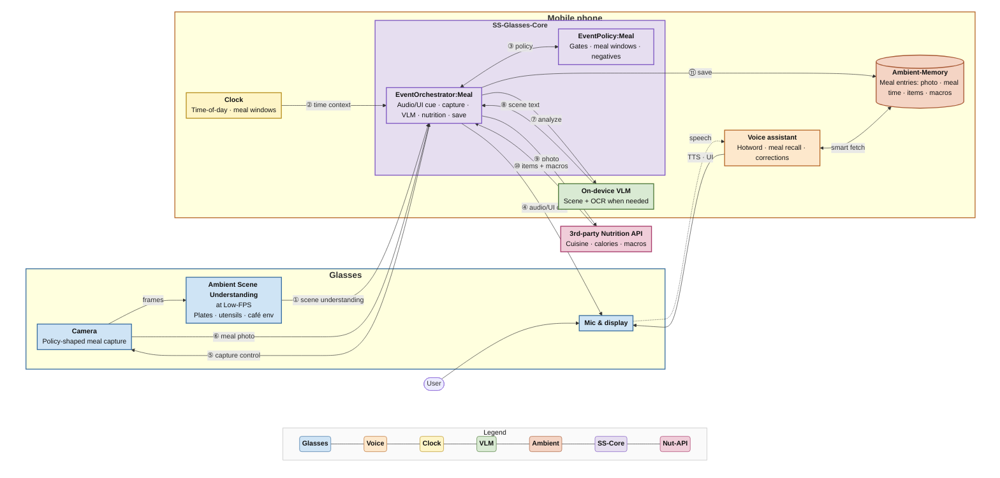

# Idea 3 — Visual Food Logging

```mermaid
%% Idea 3 — Visual Food Logging · mermaid.live
%% Layout: User + Glasses (left) → Mobile (center) → Nutrition API (right)
%% Smart-triggered: Ambient Scene Understanding at Low-FPS → policy → capture → VLM + Nutrition API → save
%% <b>…</b> = bold title inside a box
%%{init: {'flowchart': {'htmlLabels': true, 'padding': 6, 'nodeSpacing': 20, 'rankSpacing': 28}}}%%

flowchart TB
    subgraph MainRow[" "]
        direction LR
        subgraph GCol[" "]
            direction TB
            User([User])
            Spacer1[" "]
            subgraph Glasses["<b><span style='font-size:20px'>Glasses</span></b>"]
                direction TB
                Cam["<b>Camera</b><br/>Policy-shaped meal capture"]
                SceneDet["<b>Ambient Scene Understanding</b><br/>at Low-FPS<br/>Plates · utensils · café env"]
                Mic["<b>Mic & display</b>"]
            end
        end

        subgraph Mobile["<b><span style='font-size:20px'>Mobile phone</span></b>"]
            direction TB
            VA["<b>Voice assistant</b><br/>Hotword · meal recall · corrections"]
            Clk["<b>Clock</b><br/>Time-of-day · meal windows"]
            subgraph SSGC["<b><span style='font-size:16px'>SS-Glasses-Core</span></b>"]
                direction TB
                PolicyMeal["<b>EventPolicy:Meal</b><br/>Gates · meal windows · negatives"]
                OrchMeal["<b>EventOrchestrator:Meal</b><br/>Audio/UI cue · capture · VLM · nutrition · save"]
            end
            VLM["<b>On-device VLM</b><br/>Scene + OCR when needed"]
            AMEM[("<b>Ambient-Memory</b><br/>Meal entries: photo · meal time · items · macros")]
        end

        NutAPI["<b>3rd-party Nutrition API</b><br/>Cuisine · calories · macros"]
    end

    subgraph BottomDeck[" "]
        direction RL
        subgraph LegendRow["Legend"]
            direction LR
            LgG("<b>Glasses</b>")
            LgM("<b>Voice</b>")
            LgClk("<b>Clock</b>")
            LgL("<b>VLM</b>")
            LgA("<b>Ambient</b>")
            LgS("<b>SS-Core</b>")
            LgN("<b>Nut-API</b>")
            LgG --- LgM --- LgClk --- LgL --- LgA --- LgS --- LgN
        end
    end

    MainRow ~~~ BottomDeck

    Cam -->|"frames"| SceneDet
    SceneDet -->|"① scene understanding"| OrchMeal
    Clk -->|"② time context"| OrchMeal
    OrchMeal <-->|"③ policy"| PolicyMeal

    OrchMeal -->|"④ audio/UI cue"| Mic
    OrchMeal -->|"⑤ capture control"| Cam
    Cam -->|"⑥ meal photo"| OrchMeal

    OrchMeal -->|"⑦ analyze"| VLM
    VLM -->|"⑧ scene text"| OrchMeal
    OrchMeal -->|"⑨ photo"| NutAPI
    NutAPI -->|"⑩ items + macros"| OrchMeal
    OrchMeal -->|"⑪ save"| AMEM

    User --> Mic
    Mic -. speech .-> VA
    VA -->|TTS · UI| Mic
    VA <-->|smart fetch| AMEM

    classDef glasses fill:#cfe4f5,stroke:#3a6fa0,color:#111,stroke-width:2px
    classDef mobile fill:#fde8cc,stroke:#b86a2b,color:#111,stroke-width:2px
    classDef clock fill:#fef5c7,stroke:#b8901f,color:#111,stroke-width:2px
    classDef onDeviceVlm fill:#d9ead3,stroke:#4e7a3a,color:#111,stroke-width:2px
    classDef ambientMem fill:#f4d4c4,stroke:#a85a35,color:#111,stroke-width:2px
    classDef ssCoreLight fill:#e6def0,stroke:#7e57c2,color:#111,stroke-width:2px
    classDef nutritionCloud fill:#f0cdd9,stroke:#a83a6a,color:#111,stroke-width:2px
    classDef legendGlasses fill:#cfe4f5,stroke:#3a6fa0,color:#111
    classDef legendMobile fill:#fde8cc,stroke:#b86a2b,color:#111
    classDef legendClock fill:#fef5c7,stroke:#b8901f,color:#111
    classDef legendLlm fill:#d9ead3,stroke:#4e7a3a,color:#111
    classDef legendAmbient fill:#f4d4c4,stroke:#a85a35,color:#111
    classDef legendSS fill:#e6def0,stroke:#7e57c2,color:#111
    classDef legendNutrition fill:#f0cdd9,stroke:#a83a6a,color:#111
    classDef colHidden fill:none,stroke:none,color:#111

    style SSGC fill:#e6def0,stroke:#7e57c2,stroke-width:2px
    style GCol fill:none,stroke:none
    style Glasses stroke:#3a6fa0,stroke-width:2px
    style Mobile stroke:#b86a2b,stroke-width:2px
    style MainRow fill:none,stroke:none
    style BottomDeck fill:none,stroke:none
    style LegendRow fill:#fafafa,stroke:#bdbdbd,color:#111,stroke-width:1px

    class Cam,Mic,SceneDet glasses
    class Clk clock
    class VA mobile
    class VLM onDeviceVlm
    class AMEM ambientMem
    class PolicyMeal,OrchMeal ssCoreLight
    class NutAPI nutritionCloud
    class GCol,Spacer1 colHidden

    class LgG legendGlasses
    class LgM legendMobile
    class LgClk legendClock
    class LgL legendLlm
    class LgA legendAmbient
    class LgS legendSS
    class LgN legendNutrition
```
