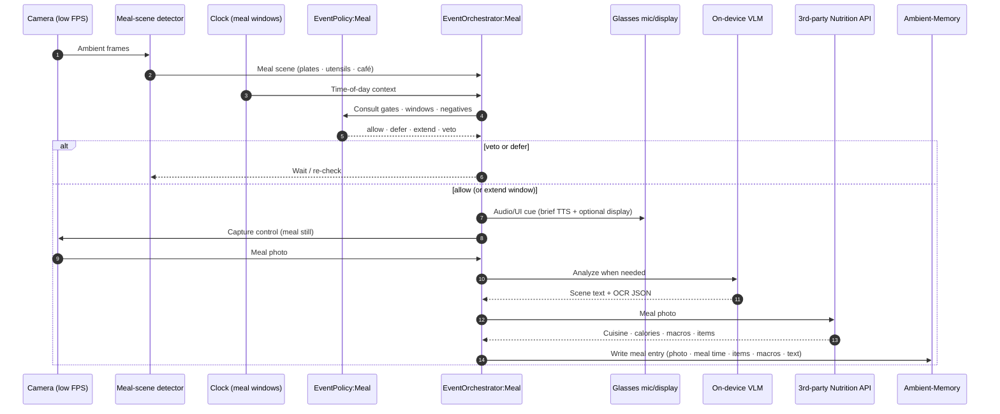
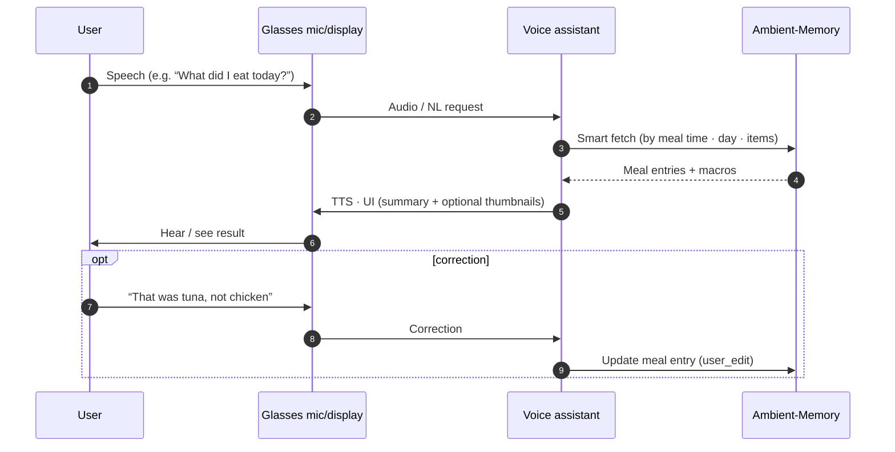
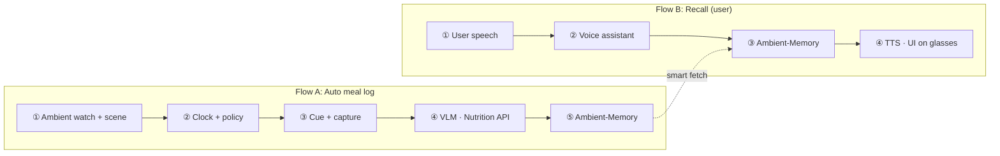

# Idea 3: Visual Food Logging

**Goal:** Log what the user eats during the day without manual entry. Glasses keep a **low-FPS ambient watch** for meal-like scenes (plates, utensils, café environment), combined with **time-of-day** and **EventPolicy:Meal** to suppress false positives. On a confident meal event, the system **auto-captures** a meal photo, enriches it with **on-device VLM** when needed, calls a **3rd-party Nutrition API** for cuisine and calories, and stores a **meal entry** (including **meal time**) in Ambient-Memory. The user can ask the **on-device voice assistant** for summaries and corrections.

**Architecture diagram:** [idea3_visual_food_logging_architecture.md](./idea3_visual_food_logging_architecture.md) (rendered Mermaid) · source: [idea3_visual_food_logging_architecture.mermaid](./idea3_visual_food_logging_architecture.mermaid)

---

## Terminology: “cue”

| Term | Meaning |
| --- | --- |
| **Audio/UI cue** | User-facing feedback when a meal is logged: **spoken TTS** through glasses speakers, plus an **optional short message or icon on the display** (e.g. “Logged: chicken salad, about 480 calories”). |
| **Retrieval cue (text)** | **Text** from on-device VLM (scene + OCR) stored with the meal entry to help search and recall. Not audio. |

---

## Components (who does what)

| Component | Role |
| --- | --- |
| **Glasses: Camera** | **Always-on low-FPS** ambient stream for meal-scene detection; **policy-shaped** higher-quality capture when orchestrator fires a meal log. |
| **Glasses: Meal-scene detector** | On-glasses vision: **plates, utensils, café / dining environment**. Uses **time-of-day priors** (breakfast, lunch, dinner windows). Does **not** use hand-to-mouth tracking. |
| **Glasses: Mic & display** | User I/O: speech in; audio cues (TTS) and optional display UI out. |
| **Mobile: Clock** | Phone time-of-day and configurable **meal windows**; feeds **EventOrchestrator:Meal** and **EventPolicy:Meal** (not the voice assistant). |
| **EventPolicy:Meal** | Gates, meal-window timing, and **negative rules** to veto false positives (TV food, grocery aisles, walking past a bakery, etc.). |
| **EventOrchestrator:Meal** | Smart-trigger path: consult policy, **audio/UI cue**, capture control, **on-device VLM** when needed, **Nutrition API** call, write meal entry with **meal time**. |
| **On-device VLM** | Scene understanding + OCR on the phone when the orchestrator needs local context before or alongside the nutrition call. |
| **3rd-party Nutrition API** | Cloud service: **cuisine type, calories, macros**, per-item breakdown from the meal photo. |
| **Ambient-Memory** | **Meal entries**: photo, **meal time** (wall-clock + meal label if inferred), items, macros, VLM text, confidence, user edits. |
| **Voice assistant** | On-device (same role as Idea 2): hotword, **meal recall** (“What did I eat today?”), **corrections**, smart-fetch from Ambient-Memory. No cloud LLM for phrasing in this design. |

---

## How numbering shows on the diagram

| Style | Where it appears | Used in |
| --- | --- | --- |
| **`autonumber`** | Small **1, 2, 3…** on each message arrow | Flow A and Flow B sequence charts below |
| **Labels on architecture** | **①–⑪** on the numbered meal-log path | Architecture diagram |

---

## Flow A: Automatic meal log (smart-triggered)

The camera runs a **continuous low-FPS food watch**. When the meal-scene detector and clock context look like a real meal, **EventPolicy:Meal** decides allow / defer / extend / veto. On allow, the orchestrator captures, analyzes, calls the Nutrition API, and saves with **meal time**.

### Step-by-step

1. **Ambient watch**: Camera streams **low-FPS** frames to the **meal-scene detector** (plates, utensils, café environment). **No hand-to-mouth** signal.
2. **Time context**: **Clock** supplies time-of-day and breakfast / lunch / dinner windows to the orchestrator and policy.
3. **Policy check**: **EventPolicy:Meal** returns allow, defer, extend, or veto to reduce false positives.
4. **Audio/UI cue**: On allow, short **TTS** (and optional display line) so the user knows a meal was logged. Skippable if policy allows silent capture.
5. **Capture**: Orchestrator requests one **representative meal photo** (optional second shot later for dessert/drinks; off by default).
6. **On-device VLM (when needed)**: Local scene + OCR for retrieval text and to support policy or API confidence.
7. **Nutrition API**: Orchestrator sends the photo to the **3rd-party Nutrition API**; receives cuisine, calories, macros, item list.
8. **Persist meal entry**: Write to **Ambient-Memory** with **meal time** (timestamp + inferred meal period), photo, items, macros, VLM text, API metadata. Debounce ~20–30 min so the same sitting is not logged twice.

### What gets stored (meal entry)

- Meal photo / thumbnail  
- **Meal time** (ISO timestamp + breakfast / lunch / dinner / snack label when inferred)  
- Items, calories, macros from Nutrition API  
- On-device VLM retrieval text (when run)  
- Confidence, source, optional `user_edits` after correction  

---

## Flow B: Recall and corrections (user)

User-initiated queries and fixes. **Clock and meal-scene detector do not** talk to the voice assistant directly.

### Step-by-step

1. **User speaks** on glasses (hotword or utterance).
2. **Voice path** to the on-device **voice assistant** on the phone (same pattern as Idea 2).
3. **Smart fetch** from Ambient-Memory, ranked by **meal time** and recency.
4. **Respond on glasses** with TTS and optional UI (today’s meals, calories so far, protein, etc.).
5. **Corrections**: Voice or phone UI edits persist as `user_edit` on the same entry. Manual **“Log this meal”** runs the same capture path as Flow A if passive detection missed.

---

## End-to-end picture

---

## Design notes

- **Smart-triggered, not user-tapped**: Low-FPS camera is always watching for **meal-like scenes**; logging fires only when policy allows.
- **Detection signals**: Plates, utensils, café/dining context, and **time-of-day**; explicitly **not** hand-to-mouth.
- **Policy is required**: Negatives and meal windows are how the product stays trustworthy (no log every food-shaped pixel).
- **Two analysis paths**: **On-device VLM** for local text/context; **Nutrition API** for cuisine and calories (specialist cloud, not a general LLM).
- **Voice assistant = Idea 2 pattern**: On-device, orange in the diagram; **smart-fetch** from Ambient-Memory only for Q&A and edits.
- **Meal time is first-class**: Stored on every entry for “today so far,” breakfast vs dinner, and debouncing.
- **Failure modes**: Missed meal → “Log this meal” voice command; wrong item → voice correction; Nutrition API offline → photo + meal time saved, macros backfilled later.

---

## Related artifacts

| File | Purpose |
| --- | --- |
| `idea3_visual_food_logging_architecture.mermaid` | System architecture (Mermaid source) |
| `idea3_visual_food_logging_architecture.md` | GitHub-renderable architecture |
| `food.md` | Superseded draft (Gemini / hand-to-mouth); use Idea 3 files above |
| `idea2.md` | Reference for voice assistant + Ambient-Memory pattern |
